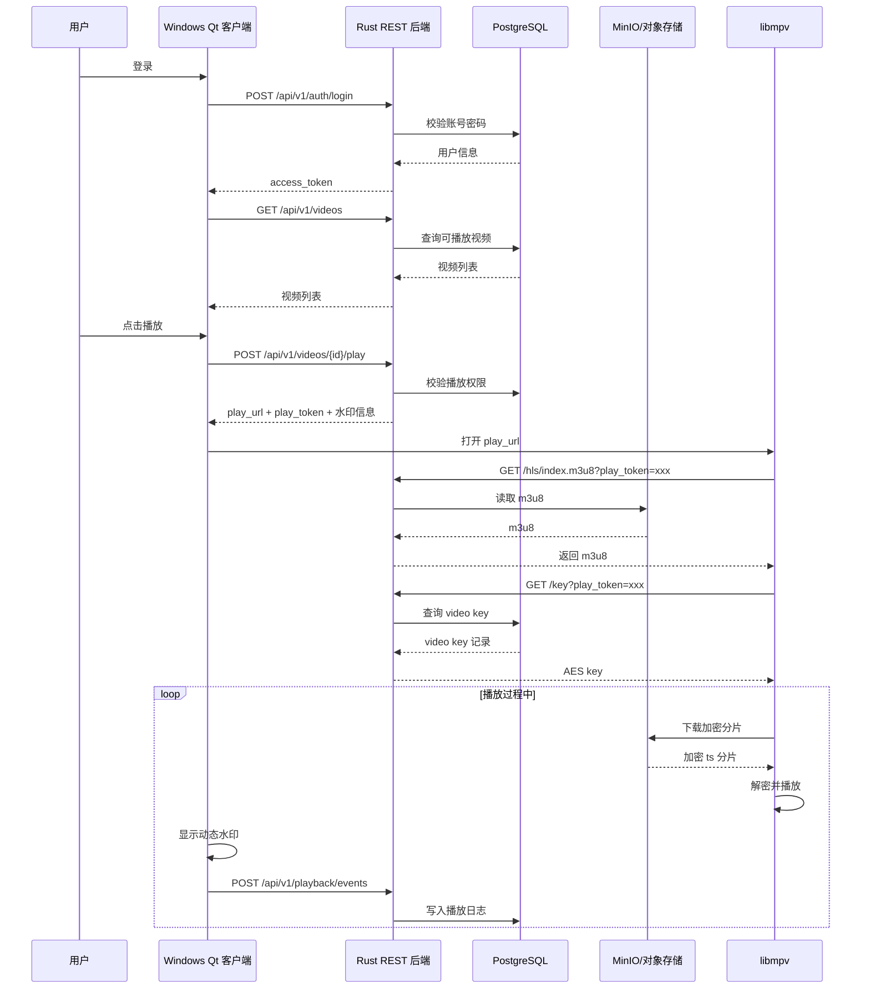

# 加密视频播放器项目详细设计

## 1. 项目目标

本项目目标是实现一套可落地的加密视频播放系统，第一阶段面向 Windows 桌面客户端，后端使用 Rust 提供 REST API，客户端使用 C++/Qt 开发，播放内核使用 libmpv。

第一版重点不是实现商业 DRM，而是建立一套安全性、性能、开发成本相对平衡的视频保护体系：

- 视频不以裸 MP4 形式直接暴露给用户。
- 视频切片后加密存储。
- 播放前必须经过后端鉴权。
- 解密密钥只通过受控接口短期下发。
- 客户端播放时叠加用户级动态水印。
- 后端记录播放、密钥请求和异常行为日志。
- 后续可逐步升级到 CDN、KMS、设备绑定、客户端加固和商业 DRM。

## 2. 总体架构

```text
Windows Qt 客户端
  |
  | REST API：登录、视频列表、播放授权、日志上报
  v
Rust 后端 API
  |
  | SQL
  v
PostgreSQL

Rust 后端 API
  |
  | S3 API
  v
MinIO / 对象存储

Rust Worker
  |
  | 调用 FFmpeg
  v
HLS AES-128 加密分片

Qt 客户端
  |
  | 嵌入播放
  v
libmpv
  |
  | 请求 m3u8、key、加密分片
  v
Rust API / MinIO
```

第一版推荐架构：

```text
客户端：Windows Qt + libmpv
后端：Rust axum REST API
数据库：PostgreSQL
对象存储：MinIO
转码打包：FFmpeg
协议：HLS AES-128
Token：PASETO 或 JWT
水印：Qt 透明覆盖层动态水印
```

Redis、CDN、Vault/KMS、NATS、商业 DRM 不作为第一版强依赖，可作为后续增强项。

## 3. 技术选型

### 3.1 后端语言：Rust

选择 Rust 的原因：

- 内存安全，适合处理鉴权、密钥、上传等安全敏感逻辑。
- 性能高，适合高并发 API。
- 异步生态成熟，适合 REST API、对象存储、数据库访问。
- 部署产物简单，服务端运行成本较低。

推荐框架：

```text
axum + tokio
```

主要依赖方向：

```text
axum：HTTP REST API
tokio：异步运行时
serde：JSON 序列化/反序列化
sqlx：PostgreSQL 访问
aws-sdk-s3：访问 MinIO/S3
tracing：日志
tower-http：中间件、CORS、trace、timeout
jsonwebtoken 或 paseto：Token
```

### 3.2 客户端：C++/Qt

选择 C++/Qt 的原因：

- 适合 Windows 桌面应用。
- UI、网络请求、窗口管理能力成熟。
- 方便集成 libmpv。
- 后续可以加入代码签名、完整性校验、反调试等客户端保护能力。

第一版客户端职责：

- 登录。
- 展示视频列表。
- 请求播放授权。
- 启动 libmpv 播放 HLS。
- 叠加动态水印。
- 上报播放事件。

### 3.3 播放内核：libmpv

选择 libmpv 的原因：

- 基于 FFmpeg，格式和协议支持成熟。
- 支持 HLS 播放。
- 支持硬件解码。
- 比直接使用 FFmpeg 自研播放管线简单很多。
- 可以嵌入 Qt 窗口。

第一版不建议直接使用 FFmpeg 自研播放器，因为音视频同步、seek、缓冲、硬解、字幕、渲染都会显著增加复杂度。

### 3.4 数据库：PostgreSQL

PostgreSQL 存储业务数据，不存储视频大文件。

主要存储：

- 用户。
- 视频元数据。
- 视频权限。
- 视频加密 key 记录。
- 上传任务。
- 转码任务。
- 设备信息。
- 播放日志。
- key 请求日志。

推荐使用：

```text
sqlx
```

原因：

- 异步。
- 性能好。
- SQL 透明。
- 支持 migration。
- 可在编译期检查 SQL。

### 3.5 对象存储：MinIO

第一版推荐使用 MinIO，原因：

- 本地开发方便。
- 私有化部署方便。
- 兼容 S3 API。
- 后续可平滑迁移到 AWS S3、阿里云 OSS、腾讯云 COS。

MinIO 存储：

- 原始 MP4。
- HLS 播放列表。
- 加密分片。
- 封面图。
- 字幕文件。

示例对象路径：

```text
raw/videos/{video_id}/source.mp4
hls/videos/{video_id}/index.m3u8
hls/videos/{video_id}/segment_000.ts
hls/videos/{video_id}/segment_001.ts
covers/{video_id}.jpg
```

### 3.6 转码和打包：FFmpeg

第一版使用 FFmpeg 生成 HLS AES-128。

FFmpeg 负责：

- 读取原始 MP4。
- 转码为 H.264/AAC。
- 切分 HLS 分片。
- 使用 AES-128 加密分片。
- 生成 m3u8 播放列表。
- 生成封面图。

第一版推荐 HLS AES-128，原因：

- 实现简单。
- FFmpeg 支持成熟。
- libmpv 播放支持成熟。
- 适合先完成加密播放链路。

### 3.7 Token：PASETO 或 JWT

Token 分两类：

- 登录 access token：用于业务 API。
- play token：用于某次视频播放授权。

第一版建议：

```text
access token：JWT 或 PASETO
play token：PASETO 或短期 JWT
```

play token 需要包含：

```text
user_id
video_id
device_id
expire_at
nonce / session_id
```

play token 有效期建议：

```text
5 到 30 分钟
```

第一版可以将 play token 放在 URL query 中，便于 libmpv 请求 m3u8 和 key：

```text
/api/v1/videos/{video_id}/hls/index.m3u8?play_token=xxx
/api/v1/videos/{video_id}/key?play_token=xxx
```

后续可改为 Header 传递，减少 token 出现在日志和 URL 中的风险。

## 4. 核心组件职责

### 4.1 Rust API 服务

职责：

- 用户登录和认证。
- 视频列表查询。
- 播放权限校验。
- 签发 play token。
- 返回 m3u8。
- key 接口鉴权。
- 播放日志接收。
- 设备注册。
- 上传任务创建。
- 转码任务状态查询。

不建议 Rust API 长期承担大量视频分片流量。第一版可以为了简单代理部分分片，生产环境应让分片走对象存储或 CDN。

### 4.2 Rust Worker

职责：

- 处理视频转码任务。
- 调用 FFmpeg。
- 生成 AES key。
- 生成 HLS 加密分片。
- 上传结果到 MinIO。
- 更新 PostgreSQL 中的视频状态。

视频转码不能在 HTTP 请求中同步完成，必须异步执行。

第一版任务队列可使用 PostgreSQL jobs 表实现：

```text
jobs
  id
  job_type
  payload
  status
  retry_count
  created_at
  updated_at
```

后续高并发转码时可升级为 NATS JetStream、Redis Queue 或其他队列。

### 4.3 PostgreSQL

职责：

- 持久化业务数据。
- 保存视频状态。
- 保存用户权限。
- 保存加密后的 video key。
- 保存播放日志和审计记录。

注意：

- 不存储视频大文件。
- 不建议明文保存视频 AES key。
- 第一版开发环境可以简化，生产环境应使用 KMS/Vault 保护 key。

### 4.4 MinIO / 对象存储

职责：

- 保存原始视频。
- 保存加密 HLS 文件。
- 保存封面、字幕。
- 为播放器或后端提供文件读取。

访问策略：

- 原始视频不公开。
- HLS 分片可通过签名 URL 或受控路径访问。
- m3u8 第一版建议由 Rust API 返回，因为需要动态写入 key URL 或校验 play token。
- key 永远不放对象存储公开访问。

### 4.5 Qt 客户端

职责：

- 用户登录。
- 管理 access token。
- 请求视频列表。
- 请求播放授权。
- 启动 libmpv。
- 显示动态水印。
- 上报播放事件。
- 处理 token 过期和播放错误。

Qt 使用 QNetworkAccessManager 调用业务 API。

### 4.6 libmpv

职责：

- 解析 HLS m3u8。
- 请求 key。
- 下载加密分片。
- 解密分片。
- 解码音视频。
- 渲染播放。
- 处理 seek、缓冲、暂停、继续。

第一版应尽量让 libmpv 处理标准 HLS，不在客户端自研 HLS 解析和 AES 解密。

### 4.7 动态水印层

职责：

- 在播放窗口上覆盖用户标识。
- 显示用户 ID、手机号尾号、时间、设备 ID 等。
- 定时移动位置。
- 使用半透明样式。
- 避免固定角落，降低被裁剪去除的可能。

第一版使用 Qt 透明 Widget 覆盖在播放区域上即可。

## 5. 组件交互流程

### 5.1 上传和转码流程

```text
1. 管理端或用户上传视频。
2. Rust API 创建视频记录，状态为 uploaded。
3. 原始 MP4 上传到 MinIO。
4. Rust API 创建转码任务。
5. Rust Worker 领取任务。
6. Worker 生成视频 AES key。
7. Worker 生成 FFmpeg keyinfo 文件。
8. Worker 调用 FFmpeg 生成 HLS AES-128。
9. Worker 将 m3u8 和 ts 分片上传到 MinIO。
10. Worker 将 video key 记录写入 PostgreSQL。
11. Worker 更新视频状态为 ready。
```

### 5.2 播放授权流程

```text
1. 用户在 Qt 客户端登录。
2. 客户端请求视频列表。
3. 用户点击播放。
4. 客户端调用 POST /api/v1/videos/{id}/play。
5. Rust API 校验用户是否有权限。
6. Rust API 生成短期 play token。
7. Rust API 返回 play_url、水印信息、过期时间。
8. Qt 客户端把 play_url 交给 libmpv。
```

### 5.3 HLS 播放流程

```text
1. libmpv 请求 index.m3u8?play_token=xxx。
2. Rust API 校验 play token。
3. Rust API 从 MinIO 读取 m3u8。
4. Rust API 返回带 key URL 的 m3u8。
5. libmpv 解析 m3u8。
6. libmpv 请求 key?play_token=xxx。
7. Rust API 校验 play token、用户、视频、设备、过期时间。
8. Rust API 返回 AES key。
9. libmpv 下载加密分片。
10. libmpv 使用 AES key 解密并播放。
11. Qt 客户端显示动态水印。
12. Qt 客户端周期性上报播放事件。
```

### 5.4 Mermaid 时序图



## 6. REST API 初步设计

### 6.1 认证接口

```http
POST /api/v1/auth/login
POST /api/v1/auth/logout
POST /api/v1/auth/refresh
GET  /api/v1/me
```

登录返回示例：

```json
{
  "access_token": "xxx",
  "refresh_token": "yyy",
  "expires_at": "2026-04-30T12:30:00Z",
  "user": {
    "id": "u_123",
    "name": "test"
  }
}
```

### 6.2 视频接口

```http
GET  /api/v1/videos
GET  /api/v1/videos/{video_id}
POST /api/v1/videos/{video_id}/play
```

播放授权返回示例：

```json
{
  "play_url": "https://api.example.com/api/v1/videos/v_123/hls/index.m3u8?play_token=xxx",
  "play_token": "xxx",
  "expires_at": "2026-04-30T12:30:00Z",
  "watermark": {
    "text": "u_123 138****1234",
    "opacity": 0.22,
    "move_interval_sec": 12
  }
}
```

### 6.3 HLS 和 key 接口

```http
GET /api/v1/videos/{video_id}/hls/index.m3u8?play_token=xxx
GET /api/v1/videos/{video_id}/key?play_token=xxx
```

key 接口返回：

```text
16 字节 AES key
```

注意：

- key 接口不返回 JSON。
- Content-Type 可使用 application/octet-stream。
- key 接口必须鉴权。
- key 接口必须记录日志。

### 6.4 播放事件接口

```http
POST /api/v1/playback/events
```

请求示例：

```json
{
  "video_id": "v_123",
  "event": "progress",
  "position_sec": 312,
  "duration_sec": 1800,
  "play_session_id": "ps_abc"
}
```

事件类型：

```text
start
pause
resume
seek
progress
ended
error
```

### 6.5 设备接口

```http
POST /api/v1/devices/register
GET  /api/v1/devices
DELETE /api/v1/devices/{device_id}
```

第一版可以只做简单 device_id 注册，不做强设备指纹。

## 7. 数据模型初稿

### 7.1 users

```text
id
username
password_hash
phone
status
created_at
updated_at
```

### 7.2 videos

```text
id
title
description
status
duration_sec
source_object_key
hls_prefix
cover_object_key
created_at
updated_at
```

状态示例：

```text
uploaded
processing
ready
failed
disabled
```

### 7.3 video_keys

```text
id
video_id
key_version
encrypted_content_key
iv
kms_key_id
created_at
```

第一版可简化为：

```text
video_id
content_key_encrypted
iv
```

### 7.4 video_permissions

```text
id
user_id
video_id
permission_type
valid_from
valid_until
created_at
```

### 7.5 playback_sessions

```text
id
user_id
video_id
device_id
play_token_id
started_at
expires_at
last_seen_at
client_ip
user_agent
```

### 7.6 playback_events

```text
id
session_id
user_id
video_id
event
position_sec
metadata
created_at
```

### 7.7 transcode_jobs

```text
id
video_id
status
input_object_key
output_prefix
error_message
retry_count
created_at
updated_at
```

## 8. HLS 加密方案

第一版使用 HLS AES-128。

每个视频生成一个 16 字节 AES content key。

FFmpeg keyinfo 文件示例：

```text
https://api.example.com/api/v1/videos/v_123/key?play_token=PLACEHOLDER
/tmp/keys/v_123.key
0123456789abcdef0123456789abcdef
```

实际生产中，m3u8 中的 key URL 需要能携带当前播放会话的 play token。建议第一版由 Rust API 动态返回 m3u8：

```text
1. MinIO 中保存基础 m3u8 模板。
2. 客户端请求 m3u8 时带 play_token。
3. Rust API 校验 play_token。
4. Rust API 将 m3u8 中 key URL 替换为带 play_token 的 URL。
5. Rust API 返回 m3u8 给 libmpv。
```

这样可以避免在对象存储中保存固定、公开、长期有效的 key URL。

## 9. 安全设计

### 9.1 基础安全原则

- 原始视频不公开访问。
- AES key 不放对象存储公开访问。
- key 接口必须鉴权。
- play token 必须短期有效。
- play token 绑定 user_id、video_id、device_id。
- play token 绑定 play_session_id，避免同一个 token 被跨会话复用。
- key 请求必须记录日志。
- 播放事件必须记录。
- 所有 API 使用 HTTPS。
- key 接口响应必须禁止缓存。

### 9.2 第一版安全能力

第一版实现：

- 登录鉴权。
- 播放权限校验。
- 短期 play token。
- HLS AES-128 分片加密。
- key 接口鉴权。
- 动态可见水印。
- 基础播放日志。
- 基础设备 ID。
- key 请求日志和异常频率记录。
- key 响应头设置 no-store，避免代理、客户端或日志系统缓存密钥。

### 9.3 内存抓 key 风险控制

客户端播放加密视频时，AES key 或可解密数据最终必须在客户端环境中出现。因此，业务流程上不能彻底阻止专业攻击者在客户端内存中抓 key。

本项目的设计目标不是让 key 永远不进入客户端，而是降低单次 key 泄露的价值，提高持续抓取成本，并让泄露行为可追踪。

第一版必须做到：

- 每个视频使用独立 AES content key，不能全站共用一把 key。
- m3u8 由 Rust API 动态返回，不能暴露长期固定 key URL。
- key URL 必须带短期 play_token。
- play_token 绑定 user_id、video_id、device_id、play_session_id 和 expire_at。
- key 接口校验 token、用户权限、视频 ID、设备 ID、过期时间。
- key 接口记录 user_id、video_id、device_id、session_id、IP、User-Agent、请求时间。
- key 接口增加基础限流，阻止同一用户、同一设备、同一 IP 的异常高频请求。
- key 响应使用 `Cache-Control: no-store` 和 `Pragma: no-cache`。
- Qt 客户端显示动态水印，使录屏或解密后传播具备追责线索。

第二阶段可以增强：

- 每 N 个分片或每 N 分钟使用一把 key，而不是整个视频只用一把 key。
- key 接口按播放进度做滑动窗口限制，只允许请求当前播放位置附近的 key。
- Redis 保存播放会话状态，包括 last_position、last_key_index、last_seen_at。
- 检测同一 play_token 被多个 IP、多个设备或多个客户端同时使用。
- 检测 key 请求很多但播放事件很少的异常行为。
- 检测短时间批量请求多个视频 key 的爬取行为。
- 异常时拒绝 key、要求重新登录、冻结播放会话或触发人工审核。

更强的防内存抓 key 方案应使用商业 DRM，例如 Widevine、PlayReady、FairPlay。商业 DRM 可以把密钥和解密路径尽量放入平台 CDM、TEE 或硬件安全环境中，自研 HLS AES-128 无法达到同等级别。

### 9.4 后续安全增强

后续增强：

- Redis 限流。
- Token 撤销。
- 设备绑定。
- 每 N 个分片或每 N 分钟一把 key。
- key 请求滑动窗口。
- 播放会话异常行为风控。
- 证书 pinning。
- 客户端完整性校验。
- 反调试。
- 反 hook。
- 本地缓存加密。
- Vault/KMS 管理密钥。
- CDN 签名 URL。
- 异常行为检测。
- DASH/CENC 和商业 DRM。

## 10. 当前 MVP 范围

第一阶段只做 Windows 客户端。

MVP 必须完成：

- Rust axum REST API。
- PostgreSQL 数据库。
- MinIO 对象存储。
- 视频上传。
- FFmpeg 生成 HLS AES-128。
- 视频状态管理。
- 用户登录。
- 视频列表。
- 播放授权。
- m3u8 鉴权返回。
- key 鉴权返回。
- Qt + libmpv 播放。
- Qt 动态水印。
- 播放日志上报。

MVP 暂不做：

- CDN。
- 商业 DRM。
- 离线缓存。
- 强设备绑定。
- 重型客户端加壳。
- 大规模转码调度。
- 多端客户端。
- DASH/CENC。

## 11. 后续演进路线

### 阶段 2：工程稳定性增强

- 引入 Redis。
- 增加 API 限流。
- 增加 play token 撤销能力。
- 完善播放会话状态。
- 记录 key 请求状态和播放进度状态。
- 检测同 token 多 IP、多设备复用。
- 检测 key 请求频率异常。
- 完善转码失败重试。
- 增加 Prometheus/Grafana 监控。
- 增加结构化审计日志。

### 阶段 3：分发能力增强

- 接入 CDN。
- 分片使用 CDN 分发。
- m3u8 仍由 Rust API 动态返回。
- 分片 URL 使用短期签名。
- 优化大并发播放场景。

### 阶段 4：密钥管理增强

- 接入 Vault 或云 KMS。
- 数据库只保存加密后的 content key。
- 后端按需向 KMS 解密。
- 增加 key 轮换机制。
- 增加 key 访问审计。
- 支持每 N 个分片或每 N 分钟一把 key。
- 支持 key 请求滑动窗口，只下发当前播放位置附近的 key。

### 阶段 5：客户端安全增强

- Windows 代码签名。
- 客户端完整性校验。
- 关键字符串加密。
- 证书 pinning。
- 基础反调试。
- 关键授权和 key 请求逻辑混淆。
- 必要时对关键逻辑做虚拟化保护。

### 阶段 6：DRM 方向升级

高价值内容可升级：

- DASH + CENC。
- Widevine。
- PlayReady。
- Apple 生态考虑 HLS + FairPlay。

此阶段不建议自研 DRM，应接入成熟平台能力。

## 12. 风险和注意事项

### 12.1 HLS AES-128 不是商业 DRM

HLS AES-128 能防普通下载和裸文件传播，但不能完全防专业逆向、内存抓 key、录屏和摄像头翻拍。

因此必须配合：

- 服务端鉴权。
- 短期 token。
- key 接口保护。
- 播放日志。
- 动态水印。

### 12.2 无法彻底阻止客户端内存抓 key

只要客户端需要播放视频，播放器就必须在某个时刻拿到可用 key 或可解密数据。因此，纯业务流程无法保证 key 不进入客户端内存。

本项目的控制思路是：

- 缩短 key 的有效时间。
- 限制 key 的适用范围。
- 将 key 绑定到用户、视频、设备和播放会话。
- 避免一次请求拿到整套内容的所有 key。
- 记录 key 请求和播放事件。
- 对异常 key 请求做风控拦截。
- 使用动态水印提高泄露追责能力。

如果业务目标要求强防内存抓 key，应在高价值内容上接入 Widevine、PlayReady、FairPlay 等商业 DRM。

### 12.3 key 接口是核心风险点

如果 key 接口设计不好，攻击者拿到 m3u8、分片和 key 后可以离线解密视频。

key 接口必须：

- 校验 token。
- 校验用户权限。
- 校验 video_id。
- 校验过期时间。
- 记录请求日志。
- 限制异常频率。
- 禁止响应缓存。
- 绑定播放会话。

### 12.4 客户端安全不能过度依赖

客户端最终要播放视频，攻击者理论上可以在客户端环境中尝试 hook、dump、录屏。

第一版应避免把主要安全性建立在客户端加壳上，而是优先做好：

- 服务端权限控制。
- 密钥生命周期。
- 水印追责。
- 异常行为检测。

### 12.5 转码任务必须异步

视频转码耗时长，不能在上传请求中同步执行。

正确方式：

```text
上传完成 -> 创建任务 -> worker 异步处理 -> 更新状态
```

### 12.6 不要让 API 服务器长期承载分片流量

视频分片流量大，生产环境应该通过对象存储和 CDN 分发。

Rust API 更适合处理：

- 鉴权。
- m3u8 动态返回。
- key 接口。
- 播放日志。

## 13. 推荐开发顺序

1. 搭建 Rust axum 项目。
2. 接入 PostgreSQL 和 migration。
3. 建立用户、视频、权限、key、任务表。
4. 接入 MinIO。
5. 实现视频上传。
6. 实现 Worker 调用 FFmpeg。
7. 生成 HLS AES-128。
8. 实现视频状态流转。
9. 实现登录和 access token。
10. 实现视频列表。
11. 实现播放授权和 play token。
12. 实现 m3u8 动态返回。
13. 实现 key 鉴权接口。
14. 实现 Qt 登录和列表。
15. 集成 libmpv 播放 HLS。
16. 实现 Qt 动态水印。
17. 实现播放事件上报。
18. 增加日志、错误处理和基础监控。
19. 增加 key 请求日志、no-store 响应头和基础限流。
20. 增加同 token 多 IP、多设备复用检测。

## 14. 结论

第一版推荐方案是：

```text
Rust axum REST API
PostgreSQL
MinIO
FFmpeg
HLS AES-128
C++/Qt
libmpv
动态水印
短期 play token
key 鉴权接口
```

这套方案开发难度中等，安全性和落地成本比较平衡。它不是商业 DRM，但适合作为加密视频播放器的第一阶段基础架构。后续可以按业务价值逐步引入 Redis、CDN、Vault/KMS、客户端加固、DASH/CENC 和商业 DRM。
